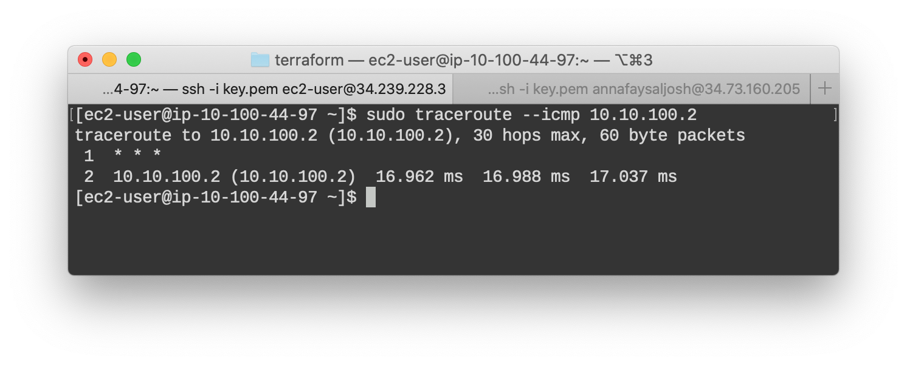
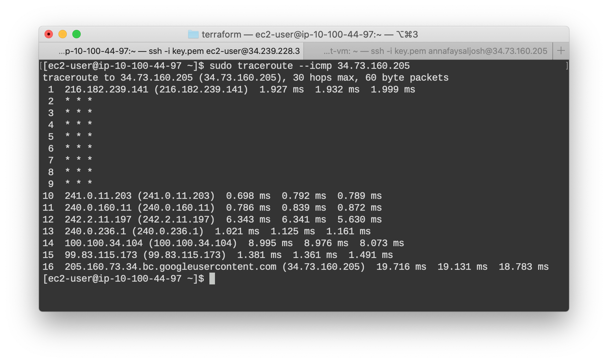
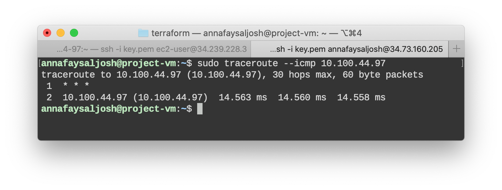
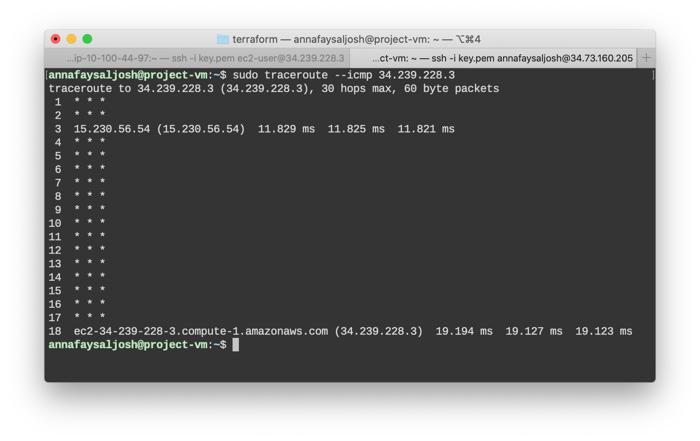

# Terraform Multi-Cloud Networking (SDN)
A project that utilizes terraform to create and deploy a highly available VPN connections between Google Cloud (GCP) and Amazon Web Services (AWS) for direct communication between VPC networks across the two cloud platforms.


## Documentation

* [Setup](docs/setup.md)
* Implementation
    * [AWS module](/docs/AWSimplement.md)
    * [GCP module](docs/GCPimplement.md)
    * [VPN module](/docs/VPNimplement.md)
* [Deployment](#deployment)


## Project Structure
```
TERRAFORM-MULTI-CLOUD
.
├── README.md
├── docs
└── terraform
    ├── main.tf
    ├── modules
    │   ├── aws
    │   ├── gcp
    │   ├── key
    │   └── vpn
    ├── outputs.tf
    ├── terraform.tfvars
    └── variables.tf
```

## Cloud Infastructure Diagram
](docs/img/multicloud_diagram.jpg)

## Deployment 
Navigate to `terraform` project directory (the one that contains `main.tf`)

after setup and implementation is complete 
```sh
terraform init 
```
to deploy the cloud infrastructure
```sh
terraform apply
```

to destroy the cloud infrastructure
```sh
terraform destroy
```

## Testing VPN connection between clouds
After running `terraform apply`, you will receive some outputs like:
```
Apply complete! Resources: 44 added, 0 changed, 0 destroyed.

Outputs:

aws_bastion_private_ip = [
  "10.100.44.97",
]
aws_bastion_public_ip = [
  "34.239.228.3",
]
ec2_ssh_command = " ssh -i key.pem ec2-user@34.239.228.3 "
gcp_ssh_command = " ssh -i key.pem annafaysaljosh@34.73.160.205"
gcp_vm_private_ip = "10.10.100.2"
gcp_vm_public_ip = "34.73.160.205"
```

Open two terminals and use the generated ssh commands to connect to the AWS and GCP compute instances in thier respective public subnets:

(Just copy and paste, making sure you are still in the `terraform` directory. The ssh keys have been generated for you by terraform.)

From one cloud instance,  compare the traceroutes to the other cloud's instance's public and private IPs (from output above). 
(Must use ICMP, as that is the trafffic we have enabled.)

```
sudo traceroute --icmp <private_ip>

sudo traceroute --icmp <public_ip>

```

### Sample Output
**From AWS host to GPC host (private IP):**

The host is reachable through its private IP, which is only available to hosts on the same network. This proves the two clouds are connected by VPN successfully. Additioanlly, we can see it takes a direct path, as it should.

**From AWS host to GPC host (public IP):**

Compare the private traceroute to this one. We can clearly see the packet has left the network and passed through many links to reach the host.

We observe the same from the GCP side.

**From GPC host to AWS host (private IP):**


**From GPC host to AWS host (public IP):**


This proves we have successfully connected the two clouds via VPN, and that the packets are routed correctly and arriving to ther destinations through the proper channels. Woohoo! 🙌

--------------------------

