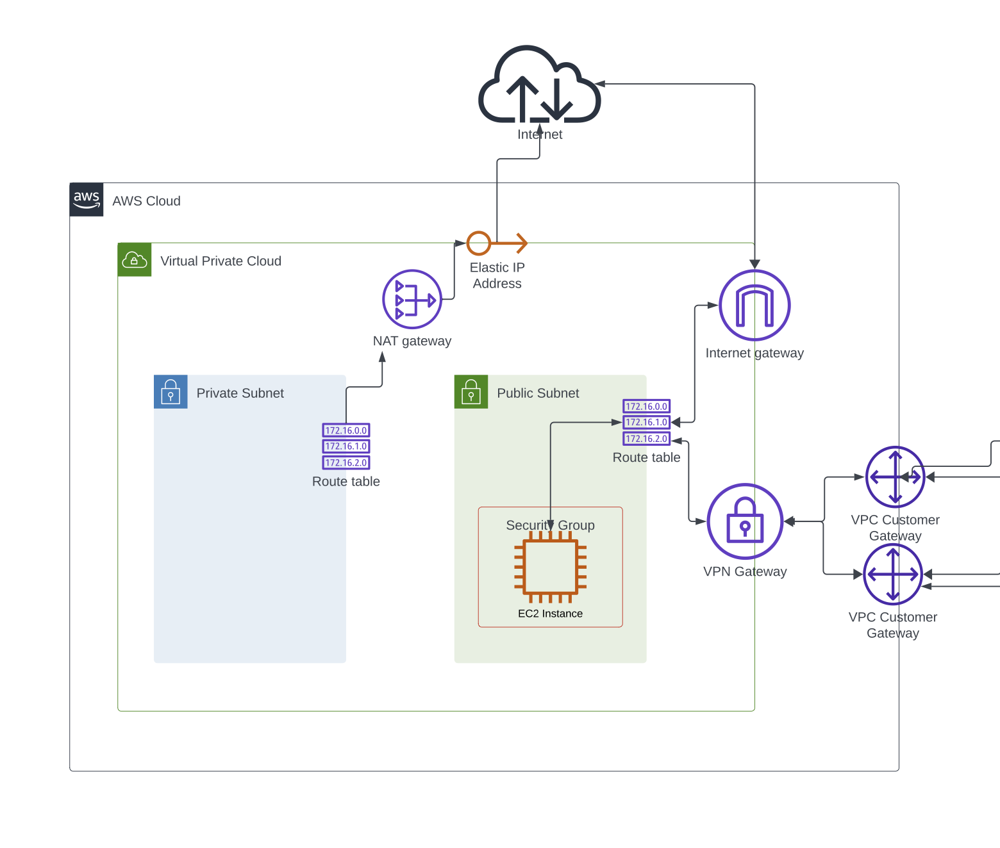

AWS Implementation
==================

## VPC Architecture

### Design Rationale
We designed the cloud architecture as a proof of concept that is extensible to a more complex distributed system.

The private and public subnets were created with the "Private Subnet Database / Public Subnet Bastion Server" architecture, and is able to be extended with a load balancer and multiple availability zones. (Otherwise, there are simpler ways to connect an EC2 instance to a VPN! But we wanted to prototype the skeleton and network devices and build the foundation for a multi-AZ system while keeping the scope testable.

Example of how the VPC could be extended? 

The VPC has Route Tables that govern the flow of internet traffic in/out of the subnets and internet gateway. AWS is able to implement router-like functionality without a dedicated router node.

### Private Subnet
The public subnet is designed so that might house a DB instance or some other private resource, and connect it to the bastion host in the public subnet, which can serve requests. The private subnet is siloed from incoming network trafffic. Outbound internet traffic is routed to the NAT gateway. 

### Public Subnet
The public subnet houses an EC2 instance. The instance is both connected to the VPN, and it open to internet traffic. In an extended design, one might close it to internet traffic and access it through the VPN only. However, we left it more open for testability of our proof of concept.

# VPN
The VPN is connected only to the public subnet.
From the AWS perspective, "Customer Gateways" are the other endpoints of the VPN tunnel - on the Google side, in our case. 

The VPN gateway has 2 VPN connections, because the Google side has 2 IP interfaces to connect to.

----------
### Glossary
**VPC**: virtual private cloud. a VPC spans all AZ' in a region

**region**: a [cluster of data centers](https://aws.amazon.com/about-aws/global-infrastructure/regions_az/). e.g. us-east-2, us-west-1, etc.

**AZ (availablity zone)**: a discrete data center

**[CIDR block](https://aws.amazon.com/what-is/cidr/)** : a collection of IP addresses that share the same network prefix and number of bits
