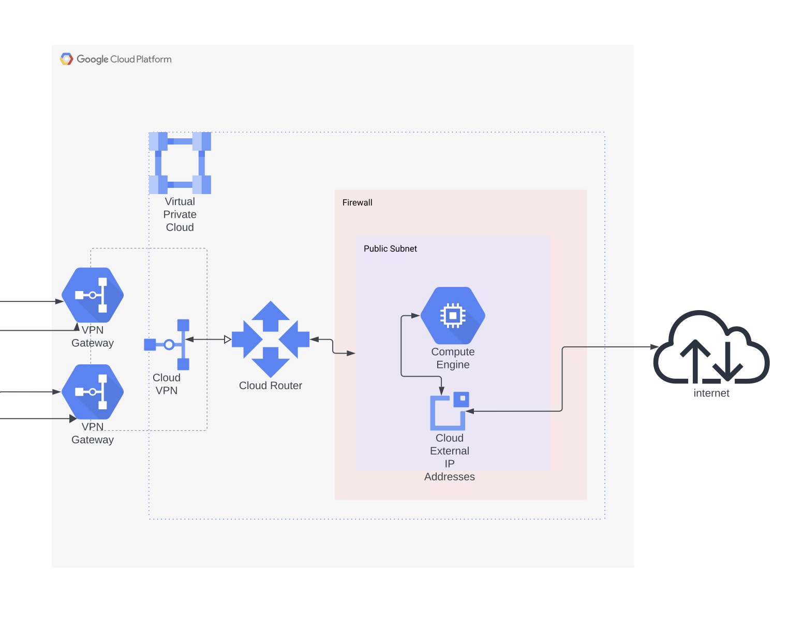

GCP Implementation
==================

```tree
gcp
├── network.tf
├── output.tf
├── compute.tf
└── variables.tf
```

# Cloud Architecture



## Network

We have a Virtual Private Cloud containing a public subnet, which contains our internet-connected Compute instance. The subnet is governed by firewall rules to all TCP, SSH, an ICMP (for pings). 

The VPC is connected to the Amazon side by two VPN gateways (one for each interface - that's how Google defines this VPN). Each interface has two BGP tunnels.

## VPN & Router
Just a quic overview. These are actually defined in the VPN module.

The Cloud Router that uses the Border Gateway Protocol (BGP) to advertise IP prefixes. It programs dynamic routes based on the BGP advertisements that it receives from a peer - the "peers" include the Amazon-side VPN endpoints. The Cloud Router is also the SDN control plane for NAT. 


## Compute

We create one compute instance in the server. The reason we have one instance buried in all this architecture, is for testing. 

The network was architected with the hope (and ability to) later be able to scale it up to multiple instances across availability zones, or a Kubernetes cluster. 

The purpose of the single instance is to test the architecture and connectivity.